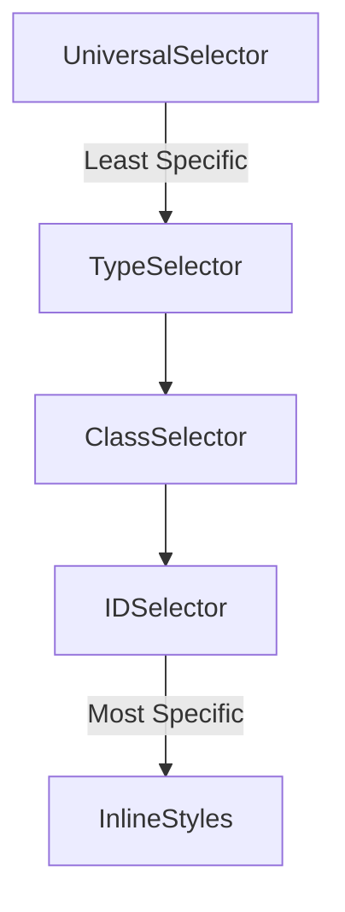

# 🏗️ The Anatomy of a CSS Selector


CSS selectors are patterns used to select and style elements on a webpage. Understanding them helps you write cleaner, more efficient, and maintainable styles. 

---

## 📖 Table of Contents
- [Introduction](#-introduction)
- [Basic CSS Selector Structure](#-basic-css-selector-structure)
- [Types of Selectors](#-types-of-selectors)
- [Selector Specificity](#-selector-specificity)
- [Advanced CSS Tricks](#-advanced-css-tricks)
- [Resources](#-resources)

---

## 🔍 Introduction
CSS selectors allow you to target HTML elements and apply styles based on different attributes, relationships, and conditions.

---

## 🎨 Basic CSS Selector Structure
```css
selector {
  property: value;
}
```
- **Selector**: Targets the HTML element(s)
- **Property**: Specifies what to change (e.g., color, margin)
- **Value**: Defines the new style (e.g., `blue`, `10px`)

**Example:**
```css
h1 {
  color: blue;
}
```
This styles all `<h1>` elements with a blue color.

---

## 🔗 Types of Selectors
CSS offers various types of selectors, including:

### 1️⃣ Universal Selector (`*`)
Applies styles to *all* elements.
```css
* {
  margin: 0;
  padding: 0;
}
```

### 2️⃣ Type Selector (`element`)
Targets specific HTML elements.
```css
p {
  font-size: 16px;
}
```

### 3️⃣ Class Selector (`.classname`)
Targets elements with a specific class.
```css
.box {
  background-color: lightgray;
}
```
**Example Usage:**
```html
<div class="box">Styled Box</div>
```

### 4️⃣ ID Selector (`#id`)
Targets a unique element by ID.
```css
#header {
  text-align: center;
}
```

### 5️⃣ Attribute Selector (`[attr]`)
Selects elements with a specific attribute.
```css
a[target="_blank"] {
  color: red;
}
```

---

## ⚖️ Selector Specificity
Selector specificity determines which rule applies when multiple styles target the same element.



> **Note:** The `!important` rule will override all normal specificity rules. Use it wisely!

---

## 🚀 Advanced CSS Tricks
### Chaining Selectors
> tips: combine selectors for more precise targeting.
```css
div.box.special {
  border: 2px solid blue;
}
```

### Pseudo-classes (`:hover`, `:nth-child()`)
```css
a:hover {
  color: green;
}
```

### Pseudo-elements (`::before`, `::after`)
```css
p::first-letter {
  font-size: 2em;
}
```

---

## 📚 Resources
For more in-depth learning, check out these resources:
- [MDN Web Docs on CSS Selectors](https://developer.mozilla.org/en-US/docs/Web/CSS/CSS_Selectors)
- [CSS Tricks - Specificity](https://css-tricks.com/specifics-on-css-specificity/)
- [W3Schools CSS Reference](https://www.w3schools.com/cssref/)

---

🚀 Happy Styling! Keep experimenting with CSS selectors to enhance your web development skills! 🎨✨

